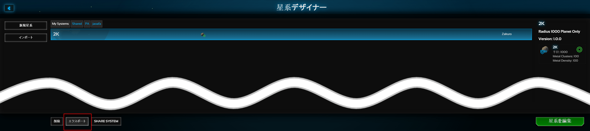
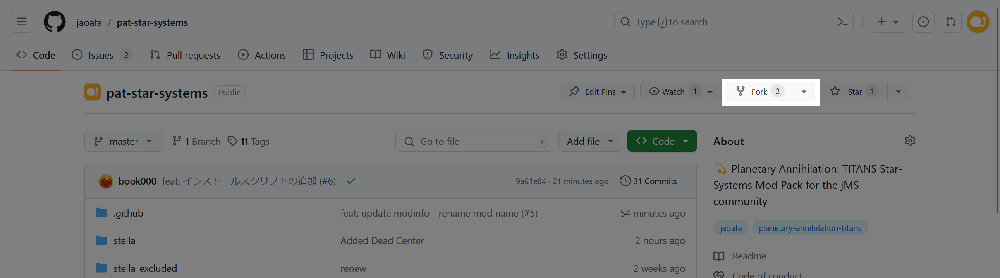
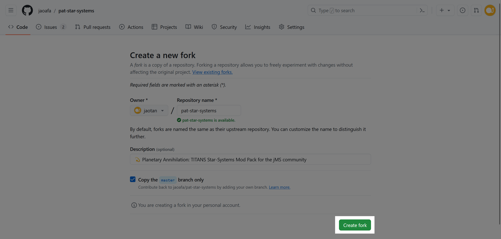
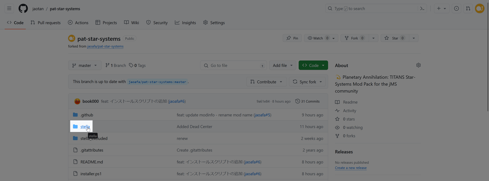
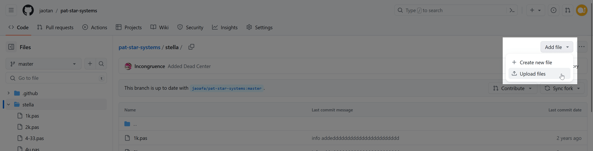
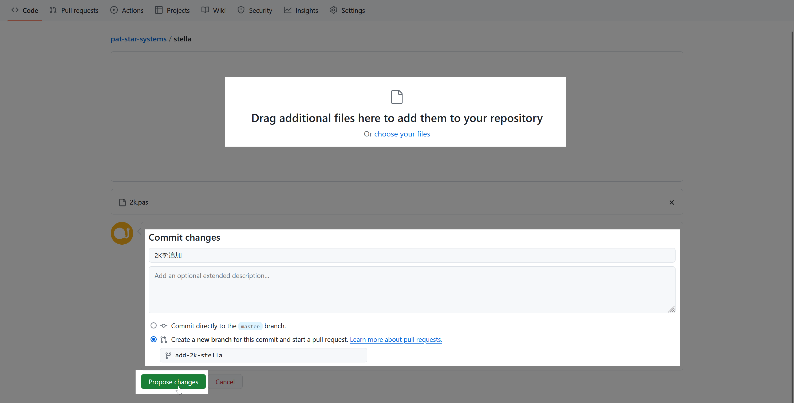
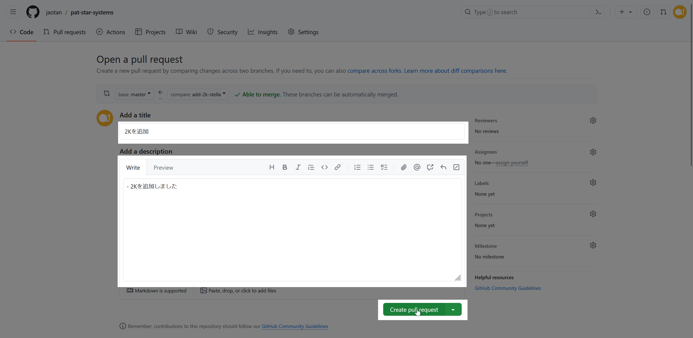

# 新規星系の追加方法

新規星系の追加リクエストをするには、pas ファイルを stella フォルダに格納し、プルリクエスト（追加依頼）を送信する必要があります。

## pasファイルのエクスポート

星系は pas という形式のファイルで共有することができます。以下の手順で pas ファイルをエクスポートしてください。

1. Planetary Annihilation: TITANS を起動し、**星系デザイナー** をクリック
2. 対象の星系をクリックし、左下の **エクスポート** をクリック
3. 任意の場所に保存

## GitHub でプルリクエストを作成

以下の手順で、新規に追加する pas ファイルをアップロードし、プルリクエストを実施してください。  
GitHub をあまり使ったことがない方のために、GitHub Web UI を用いたコミット・プルリクエスト方法で説明しますが、ほかの方法でプルリクエストを作成いただいても構いません。

### 1. リポジトリのフォーク

> [!NOTE]
> 2回目以降、この操作は不要です。「2. pas ファイルのアップロード」に進んでください。

[jaoafa/pat-star-systems リポジトリのページ](https://github.com/jaoafa/pat-star-systems) を開き、右上の **Fork** をクリックします。

`Create a new fork` というページが開くので、下部の **Create fork** をクリックしてください。

この操作を実施すると、あなたのアカウント下にリポジトリがコピー（フォーク）されます。

### 2. pas ファイルのアップロード

あなたのアカウントにフォークされたリポジトリのページ（`<あなたのアカウント名>/pat-star-systems`）を開き、**stella** フォルダをクリックします。

既存の星系ファイル群が表示されるので、右上の **Add file** をクリックしたあと、**Upload files** をクリックします。

`Drag additional files here to add them to your repository`（追加ファイルをここにドラッグすると、リポジトリに追加されます）と表示されるので、この枠内に pas ファイルをドラッグアンドドロップするか、**choose your files** というリンクをクリックし、pas ファイルを選択してください。

アップロードが終わったら、タイトルを入力し、**Propose changes** をクリックします。

### 3. プルリクエストの作成

ページが遷移し、`Open a pull request` というページが開きます。

`Add a title` の入力欄にタイトルを、`Add a description` の入力欄に追加した星系についての説明文を入力してください。  
入力したら、**Create pull request** ボタンをクリックします。

これで、新規惑星の追加依頼ができました。jao Community の Admin によって確認されたあと、問題なければ採用されます。
